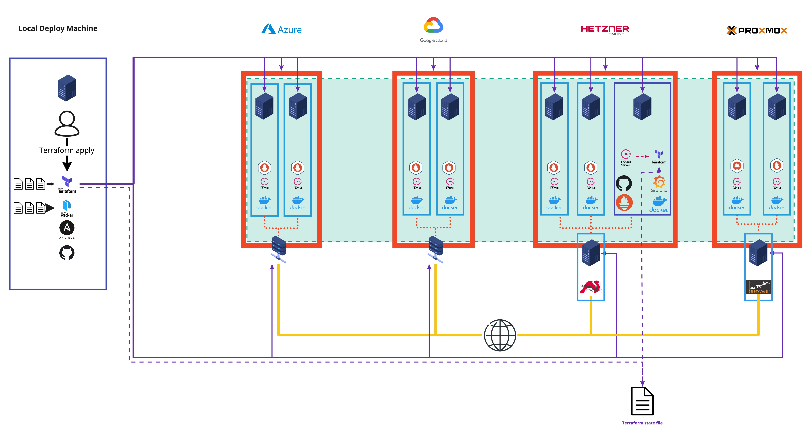
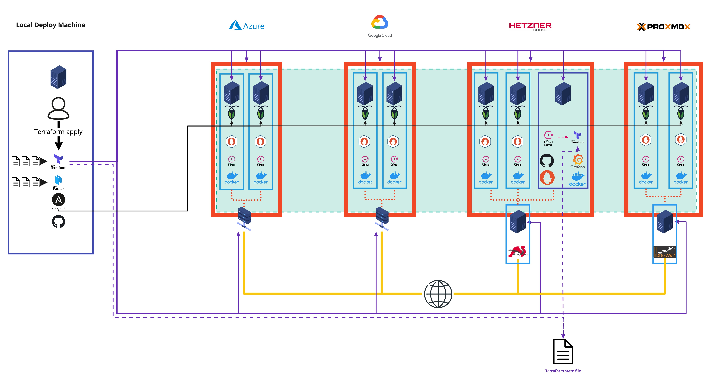

# Building Resilient Infrastructure by Spanning Clouds
***From cloudy to overcast***

## TOC
1. [Introduction](#introduction)
2. [How does it work](#how-does-it-work)
3. [Deploy cluster](#deploy-cluster)
4. [Deploy a service](#deploy-a-service)
5. [Benchmarking](#benchmarking)

## Introduction
This is the repository for the project "Building Resilient Infrastructure by Spanning Clouds", which was developed as 
part of the module "Advanced Distributed System Prototyping" at the Technical University Berlin in the winter semester 
2020/2021.

The main goal of this project is to build a more resilient infrastructure by spanning clouds. To achieve this goal, we 
deploy virtual machines across different cloud providers and span a single network over all of them. Afterwards, we deploy monitoring 
solutions and create watchdogs that ensure that failed infrastructure is re-created.

## How does it work?

This project provides a cluster of nodes, spanned accross different cloud providers but connected through one private network. We add additional tooling to harmonize monitoring, automate node discovery and configure health checks. Services can be installed on the cluster once deployed.  
For the automatic deployment of the infrastructure we use a tool called [Terraform](https://www.terraform.io/). We build the infrastructure based on custom linux images that we build with [Packer](https://www.packer.io/). We use [Ansible](https://www.ansible.com/) to for some post deployment actions.

## Deploy cluster
Once deployed, the cluster will look as follows:



The example will deploy two "worker VMs" on every cloud provider as well as a gateway VM for Hetzner and Proxmox. 
In addition, a "resinfra VM" is deployed to host the necessary tooling. *Note, to achieve high availability, the services running on the gateway
VMs as well as the "resinfra VM" need to be distributed across multiple nodes. This is not implemented yet.
All services used for the tooling can be deployed as distributed services. For the gateways, a multi gateway setup 
should be aimed for. 

### Required software

First, install the following software on your machine:

- [Hashicorp](https://www.hashicorp.com/) Terraform and Packer
- [Ansible](https://docs.ansible.com/ansible/2.5/installation_guide/intro_installation.html)
- [Azure CLI](https://docs.microsoft.com/en-us/cli/azure/install-azure-cli)
- (optional) [Google Cloud CLI](https://cloud.google.com/sdk/docs/quickstart)

### Setting up projects on each provider

We support Azure, GCP, Hetzner Cloud, and Proxmox. 

- On Azure, create a subscription (or re-use an existing one) and a resource group.
- On GCP and Hetzner Cloud, create a project.

For each provider, generate the required credentials and put them in 
[`terraform/terraform.tfvars`](terraform/terraform.tfvars) and [`packer/packer-vars.json`](packer/packer-vars.json). 
There are guides available on how to generate credentials for 
[Azure](https://registry.terraform.io/providers/hashicorp/azurerm/latest/docs/guides/azure_cli), 
[GCP](https://registry.terraform.io/providers/hashicorp/google/latest/docs/guides/getting_started#adding-credentials), and 
[Hetzner](https://docs.hetzner.cloud/). For GCP, instead of setting an environment variable to the path of the 
service account JSON, add the path to the following three configuration files:

- [`terraform/terraform.tfvars`](terraform/terraform.tfvars)
- [`terraform/backend.tf`](terraform/backend.tf)  
- [`packer/packer-vars.json`](packer/packer-vars.json)

### Setting up remote terraform state storage

By default, the terraform state is stored in a bucket on GCP. This is required to make use of our system's self-healing 
capabilities, and a best practice for production deployments using terraform. For most development tasks, it is ok to 
delete the `backend` block in [`terraform/backend.tf`](terraform/backend.tf). For other use cases, follow the 
instructions (the bucket needs to exist before you run `terraform init`):

1. [Create a bucket](https://console.cloud.google.com/storage/create-bucket) in your GCP project. 
2. Make sure that your GCP service account has read / write permission for it. 
3. Edit the bucket name in [`terraform/backend.tf`](terraform/backend.tf), commit and push.

Keep in mind that bucket names are globally unique – if you want to collaborate with others, you have two options. For 
production, we recommend letting everyone's service accounts access the same bucket. For development and testing, 
everyone can create their own buckets, edit the [`terraform/backend.tf`](terraform/backend.tf), but not commit the 
changes.

### Building images

Ensure all images are built and ready. In short,

```
$ cd packer
$ for file in */*.pkr.hcl; do packer build -var-file=packer-vars.json "$file"; done
```

This step will not need to be run again until you change any of the images. For more information refer to the [packer readme](packer/README.md).

### Deploying

Deploy _everything_ (includes GCP, Hetzner Cloud, Proxmox and Azure): 

```
$ cd terraform
$ terraform init
$ terraform apply
$ terraform taint module.hetzner.null_resource.copy_ipsec_files
$ terraform taint module.proxmox.null_resource.copy_ipsec_files
$ terraform apply
```

`terraform init` is usually only needed before deploying for the very first time. The last three commands are a workaround to force proper 
configuration of the VPN connections between Azure and Hetzner / Proxmox. To deploy only parts of the infrastructure, make according changes in 
the terraform files. For more information refer to the [infrastructure README](terraform/README.md).

## Deploy a service 
Once terraform has successfully terminated, the cluster is ready. You should be able to 
access it through any worker VM's public IP address. The IP addresses are displayed at the end of `terraform apply`.

You are now ready to deploy any service on the cluster. One way would be to use an ansible script for that. You can find 
an example playbook to deploy a [coackroachDB](https://www.cockroachlabs.com/) cluster [in the ansible directory](ansible)
or take a look at the [benchmarking setup](benchmarks/code). With cockroachDB installed, the cluster would look as follows:


## Benchmarking
We have benchmarked the cluster with regard to networking performance. We have deployed a cockroachDB cluster on both 
a single-provider machine cluster as well as on a multi-cloud machine cluster, with all european deployments. We used the TPC-C benchmark to create a load
on the service. Note, that we are specifically not benchmarking the performance of the service (cockraochDB) itself but 
are interested in how network latency changes across the two scenarios. The load of the benchmark is therefore rather minimalistic.

Unsurprisingly, **latency on the TPC-C benchmark increased substantially** (by about 800%). Note, that this does not 
imply that the latency between any two nodes of the cluster has increased by that amount. Because of how cockroachDB works, 
data is moved between nodes multiple times per query. Pings between nodes can be retrieved from the Consul dashboard.
Also note, that latency for the multi-cloud setup is strongly dependent on the geographic distribution of the infrastructure on the different 
providers. 

Second, **costs are strongly increasing** (by about 75% for the scenario above). Egress traffic can be very expensive depending
on the chosen cloud providers and will become a relevant cost driver, especially for services that exchange large amounts of data.

Detailed benchmarking results can be found in the [benchmarking directory](benchmarks).
