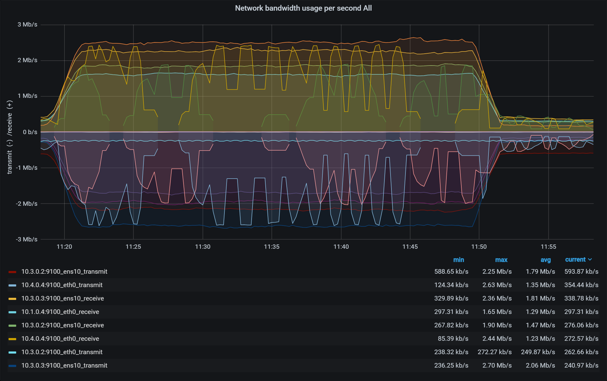

# Results for CockroachDB benchmark on a cluster deployed on all 4 providers

For in depth data, see the [data directory](data).

Performed on 8 nodes, 2 on each provider, with 2 vCPUs each.

## Import

Executed from a machine outside the cluster, and limited to only 8 parallel connections instead of 16 to improve stability.

`./workload init tpcc --warehouses 100 --drop --init-conns 8 "postgres://root@159.69.84.172:26257?sslmode=disable"`

### Durations

```
I210220 11:13:06.293201 1 workload/workloadsql/dataload.go:146  [-] 1  imported warehouse (2s, 100 rows)
I210220 11:13:06.669586 1 workload/workloadsql/dataload.go:146  [-] 2  imported district (0s, 1000 rows)
I210220 11:35:43.247276 1 workload/workloadsql/dataload.go:146  [-] 3  imported customer (22m37s, 3000000 rows)
I210220 11:37:47.337529 1 workload/workloadsql/dataload.go:146  [-] 4  imported history (2m4s, 3000000 rows)
I210220 11:41:56.850559 1 workload/workloadsql/dataload.go:146  [-] 5  imported order (4m10s, 3000000 rows)
I210220 11:42:12.983979 1 workload/workloadsql/dataload.go:146  [-] 6  imported new_order (16s, 900000 rows)
I210220 11:42:16.301766 1 workload/workloadsql/dataload.go:146  [-] 7  imported item (3s, 100000 rows)
I210220 11:54:01.685382 1 workload/workloadsql/dataload.go:146  [-] 8  imported stock (11m45s, 10000000 rows)
I210220 12:12:54.479516 1 workload/workloadsql/dataload.go:146  [-] 9  imported order_line (18m53s, 30005985 rows)
```

### system metrics


## Benchmark

### Summary

```
_elapsed___errors_____ops(total)___ops/sec(cum)__avg(ms)__p50(ms)__p95(ms)__p99(ms)_pMax(ms)__total
1800.0s        0           3732            2.1    675.4    704.6   1040.2   1342.2   2818.6  delivery

_elapsed___errors_____ops(total)___ops/sec(cum)__avg(ms)__p50(ms)__p95(ms)__p99(ms)_pMax(ms)__total
1800.0s        0          36821           20.5    385.0    402.7    637.5    872.4   2952.8  newOrder

_elapsed___errors_____ops(total)___ops/sec(cum)__avg(ms)__p50(ms)__p95(ms)__p99(ms)_pMax(ms)__total
1800.0s        0           3704            2.1    116.0    125.8    184.5    234.9    637.5  orderStatus

_elapsed___errors_____ops(total)___ops/sec(cum)__avg(ms)__p50(ms)__p95(ms)__p99(ms)_pMax(ms)__total
1800.0s        0          37037           20.6    352.3    352.3    570.4    805.3   1811.9  payment

_elapsed___errors_____ops(total)___ops/sec(cum)__avg(ms)__p50(ms)__p95(ms)__p99(ms)_pMax(ms)__total
1800.0s        0           3731            2.1    113.4    121.6    192.9    318.8    671.1  stockLevel

_elapsed___errors_____ops(total)___ops/sec(cum)__avg(ms)__p50(ms)__p95(ms)__p99(ms)_pMax(ms)__result
1800.0s        0          85025           47.2    359.9    352.3    671.1    939.5   2952.8
Audit check 9.2.1.7: SKIP: not enough delivery transactions to be statistically significant
Audit check 9.2.2.5.1: PASS
Audit check 9.2.2.5.2: PASS
Audit check 9.2.2.5.3: PASS
Audit check 9.2.2.5.4: PASS
Audit check 9.2.2.5.5: PASS
Audit check 9.2.2.5.6: SKIP: not enough order status transactions to be statistically significant

_elapsed_______tpmC____efc__avg(ms)__p50(ms)__p90(ms)__p95(ms)__p99(ms)_pMax(ms)
1800.0s     1227.4  95.4%    385.0    402.7    536.9    637.5    872.4   2952.8
```

### System metrics



