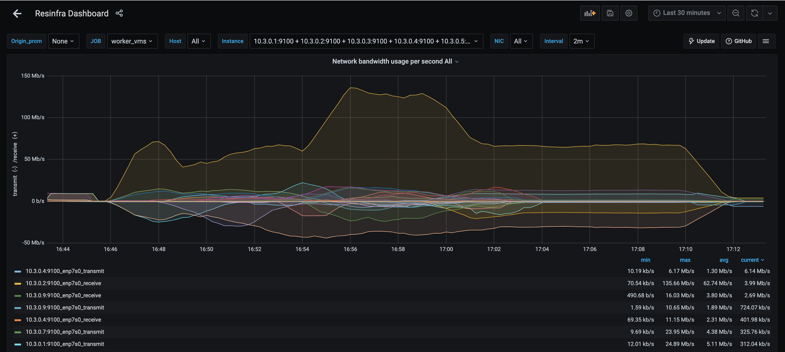
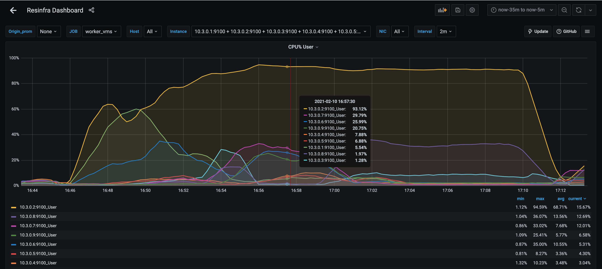
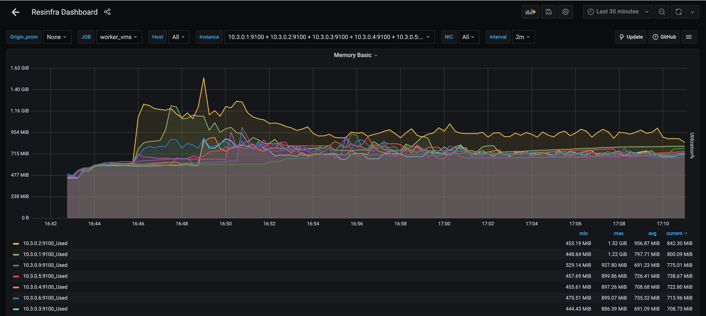
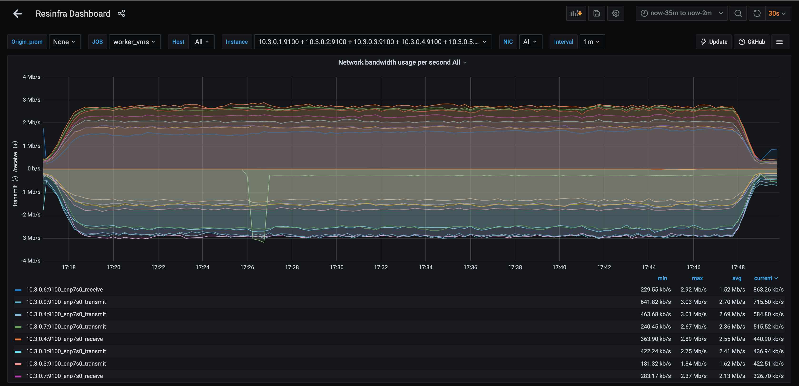
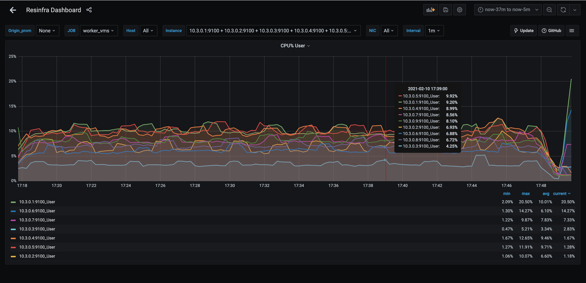
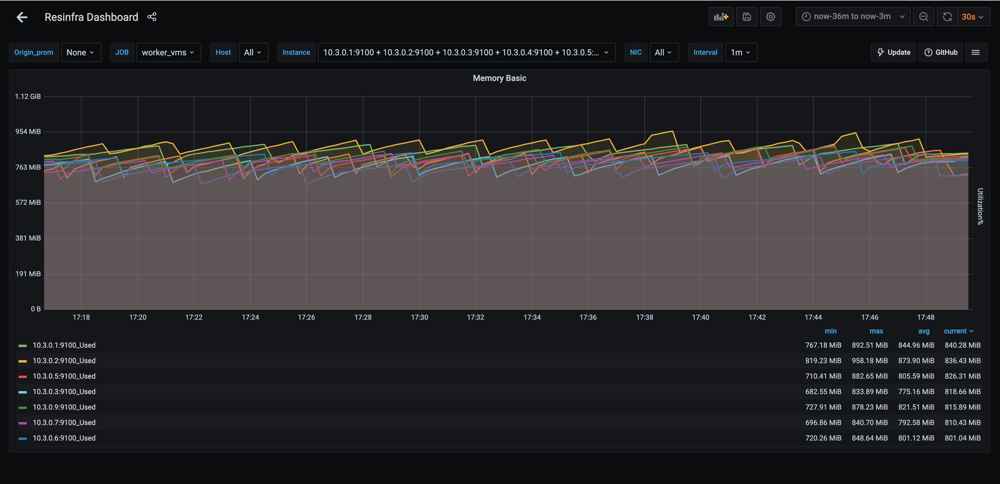

# Results for CockroachDB benchmark on a cluster deployed on hetzner only
For in depth data, see the [data directory](data)

Performed on a 9 node cluster of CPX31 (4 vCPU / 8GB RAM) machines. 
## before you begin
Use terraform to spin up the necessary infrastructure.
Execute from the [code directory](../../code/hetzner_only).
```
terraform apply
```
Navigate to grafana and install the [dashboard](../../dashboard.json).

`ssh` into the benchmarker machine. All following commands must be executed from that machine.
## import
Command executed:
```
./workload init tpcc --warehouses 100 "postgres://root@10.3.0.2:26257?sslmode=disable"
```
### import times
```
I210210 15:45:48.098849 1 workload/workloadsql/dataload.go:146  [-] 1  imported warehouse (0s, 100 rows)
I210210 15:45:48.228541 1 workload/workloadsql/dataload.go:146  [-] 2  imported district (0s, 1000 rows)
I210210 15:51:56.274480 1 workload/workloadsql/dataload.go:146  [-] 3  imported customer (6m8s, 3000000 rows)
I210210 15:53:03.016555 1 workload/workloadsql/dataload.go:146  [-] 4  imported history (1m7s, 3000000 rows)
I210210 15:53:54.612520 1 workload/workloadsql/dataload.go:146  [-] 5  imported order (52s, 3000000 rows)
I210210 15:53:59.857965 1 workload/workloadsql/dataload.go:146  [-] 6  imported new_order (5s, 900000 rows)
I210210 15:54:01.002452 1 workload/workloadsql/dataload.go:146  [-] 7  imported item (1s, 100000 rows)
I210210 15:59:08.626036 1 workload/workloadsql/dataload.go:146  [-] 8  imported stock (5m8s, 10000000 rows)
I210210 16:09:54.150734 1 workload/workloadsql/dataload.go:146  [-] 9  imported order_line (10m46s, 30005985 rows)
```
### system metrics






## benchmark

Command executed:
```
./workload run tpcc \
--warehouses 100 \
--ramp 1m \
--duration 30m \
--histograms benchmark_results	\
 postgres://root@10.3.0.1:26257?sslmode=disable postgres://root@10.3.0.2:26257?sslmode=disable postgres://root@10.3.0.3:26257?sslmode=disable postgres://root@10.3.0.4:26257?sslmode=disable postgres://root@10.3.0.5:26257?sslmode=disable postgres://root@10.3.0.6:26257?sslmode=disable postgres://root@10.3.0.7:26257?sslmode=disable postgres://root@10.3.0.8:26257?sslmode=disable postgres://root@10.3.0.9:26257?sslmode=disable
```

### summary
```
_elapsed___errors_____ops(total)___ops/sec(cum)__avg(ms)__p50(ms)__p95(ms)__p99(ms)_pMax(ms)__total
 1800.0s        0           3736            2.1     81.2     83.9    104.9    121.6    419.4  delivery

_elapsed___errors_____ops(total)___ops/sec(cum)__avg(ms)__p50(ms)__p95(ms)__p99(ms)_pMax(ms)__total
 1800.0s        0          37330           20.7     44.2     44.0     58.7     71.3    302.0  newOrder

_elapsed___errors_____ops(total)___ops/sec(cum)__avg(ms)__p50(ms)__p95(ms)__p99(ms)_pMax(ms)__total
 1800.0s        0           3757            2.1     12.2     12.1     17.8     22.0     37.7  orderStatus

_elapsed___errors_____ops(total)___ops/sec(cum)__avg(ms)__p50(ms)__p95(ms)__p99(ms)_pMax(ms)__total
 1800.0s        0          37474           20.8     25.8     26.2     35.7     46.1    142.6  payment

_elapsed___errors_____ops(total)___ops/sec(cum)__avg(ms)__p50(ms)__p95(ms)__p99(ms)_pMax(ms)__total
 1800.0s        0           3706            2.1     26.1     26.2     33.6     41.9     79.7  stockLevel

_elapsed___errors_____ops(total)___ops/sec(cum)__avg(ms)__p50(ms)__p95(ms)__p99(ms)_pMax(ms)__result
 1800.0s        0          86003           47.8     35.6     31.5     62.9     92.3    419.4
Audit check 9.2.1.7: SKIP: not enough delivery transactions to be statistically significant
Audit check 9.2.2.5.1: PASS
Audit check 9.2.2.5.2: PASS
Audit check 9.2.2.5.3: PASS
Audit check 9.2.2.5.4: PASS
Audit check 9.2.2.5.5: PASS
Audit check 9.2.2.5.6: SKIP: not enough order status transactions to be statistically significant

_elapsed_______tpmC____efc__avg(ms)__p50(ms)__p90(ms)__p95(ms)__p99(ms)_pMax(ms)
 1800.0s     1244.3  96.8%     44.2     44.0     54.5     58.7     71.3    302.0
```

### system metrics




