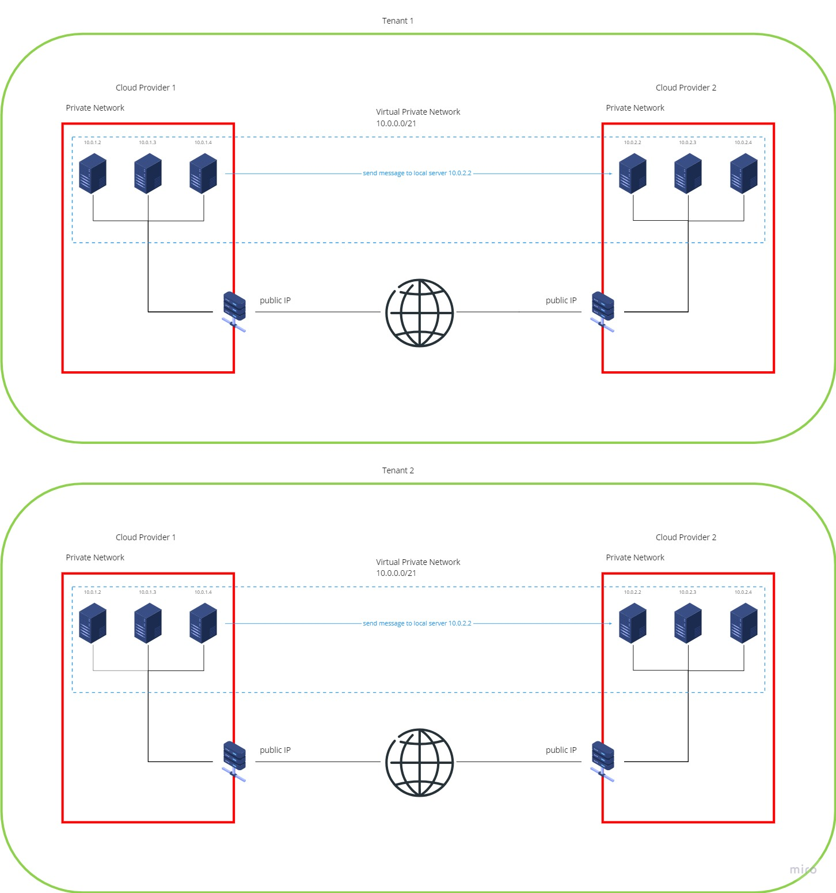
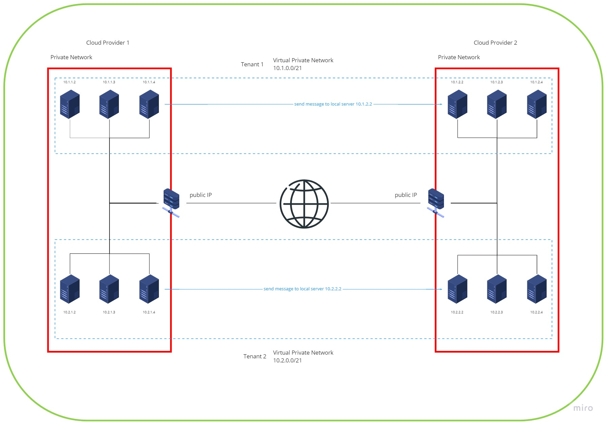

# Connecting VMs across different cloud providers, AWS and Azure, in a MT-compatible way

This is the report on item [#146](https://app.clubhouse.io/thinkdeep/story/146/investigate-and-design-an-architecture-to-connect-the-vms-across-different-cloud-providers-revisited). It is an extension of the [previous report](Azure-AWS-VPN.md). Again, we can use either a DIY VPN solution using open source tools (BIRD and Wireguard were mentioned during planning), or managed services offered by the cloud providers.

Multiple tenants can be isolated either using seperate VPCs for each tenant...

...or by using a single global VPC for all tenants and putting each tenant in their own subnet:

## Per-Tenant VPC

For this approach, the steps described in the [previous report](Azure-AWS-VPN.md) would need to be repeated for each tenant. Due to the near-total separation between tenants, we would not introduce any conflicts or additional security issues. It is also likely to be the simplest solution.

### Cost Estimation

Three services costing actual money would be replicated for each tenant: The VPN gateways, and the public IP address for Azure. Depending on the amount of inter-cloud traffic, this might become neglible compared to the cost of outbound traffic. The figures stated in the previous report remain valid.

## Global VPC with subnet-level tenant separation

We could use one common VPN gateway each on Azure and AWS. But really, we should not do that, because we would basically be re-implementing VPCs, just worse.
