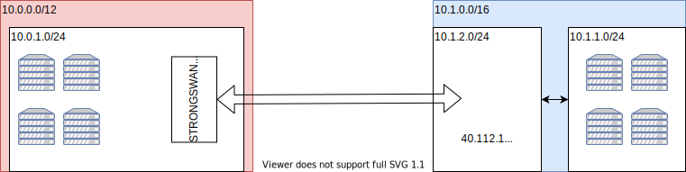

# Connecting VMs on Hetzner to Those on Azure

This is the report on the VPN connection between Hetzner and Azure. For now, AWS is out of scope because we do not have free access to the VPN gateway there.
There are two notable differences between Hetzner and the mainstream cloud providers:

- There is no concept of a VPC. Instead, separation can be achieved through separate projects or networks within a single project.
- There is no managed VPN service.

## Total Chaos

We could connect our machines without any tunnel. If all machines have public IP addresses, we could adapt firewall routes so that incoming traffic from our machines hosted on other cloud providers is allowed. We could then save the expenses, configuration effort, and introduction of a point of failure associated with a VPN solution. However, this solution would also have drawbacks:

- All machines need to be reachable by a public IP address.
- There can be no IP broadcast across cloud providers. This might have implications on service discovery.
- Keeping firewall rules up-to-date would likely be difficult.

## VPN-based Solution

### IPSec Basics

IPSec is an open OSI layer 3 protocol suite for secure network communication. In tunnel mode, it can be used for VPN connections:


([By Ford prefect - Own work, CC BY 3.0](https://commons.wikimedia.org/w/index.php?curid=10438053))

The tunnel works by encapsulating and encrypting the original IP package, adding authentication headers to guarantee integrity & authentication, and sending it over the network. 


([By Mpk1024 - Own work, CC BY-SA 4.0](https://commons.wikimedia.org/w/index.php?curid=97123608))

### Available Software

IPSec is implemented in the Linux kernel, but we need additional software to establish the security association between the gateways. This is done using IKE, which is implemented in FOSS projects such as OpenSWAN, LibreSWAN, and StrongSWAN. The easiest way to get them running quickly on HCloud may be a pre-built docker image (e.g. for [LibreSWAN](https://github.com/hwdsl2/docker-ipsec-vpn-server)), but the installation process on a VM is pretty straightforward as well.

We arbitrarily chose [StrongSWAN](https://www.strongswan.org/).

### The Cloud Perspective

From the cloud providers' perspective, a VM running StrongSWAN is just a software customer gateway device (as opposed to a dedicated customer gateway device from vendors such as Cisco, Uniper, ...). 

### Working Setup

We got the following setup running, fully automated through Terraform & Ansible. HCloud is shown on the left, Azure on the right:



A machine hosted on HCloud can reach one on Azure...

```text
root@ubuntu-2gb-hel1-1:~# traceroute 10.1.1.4
traceroute to 10.1.1.4 (10.1.1.4), 30 hops max, 60 byte packets
 1  10.0.0.1 (10.0.0.1)  16.334 ms  16.256 ms  16.218 ms
 2  10.0.1.1 (10.0.1.1)  24.059 ms  23.991 ms  23.992 ms
 3  10.1.1.4 (10.1.1.4)  185.230 ms  185.178 ms  185.129 ms
```

...and vice-versa...

```text
azureuser@some-vm:~$ traceroute 10.0.1.2
traceroute to 10.0.1.2 (10.0.1.2), 30 hops max, 60 byte packets
 1  10.0.1.1 (10.0.1.1)  164.965 ms  164.945 ms  164.931 ms
 2  * * *
 3  10.0.1.2 (10.0.1.2)  215.453 ms  215.440 ms  215.427 ms
```

To achieve this result, there are two important steps:

#### Setting up the tunnel between the VPN gateways

We need to configure the VPN gateways on Azure and HCloud consistently. There are *a lot* of tutorials available online — none of which worked. The two configurations need to be tweaked carefully to find a common cipher suite. Otherwise, the security association cannot be established. The Azure side [is configured through Terraform](terraform/main.tf), StrongSWAN receives its [ipsec.conf](ansible/ipsec.conf.j2) and [ipsec.secrets](ansible/ipsec.secrets.j2) through Ansible.

#### Setting up Routes

On Azure (and AWS), the StrongSWAN instance is represented as the *Local Network Gateway* (AWS: *Customer Gateway*) resource. This resource is configured with the CIDR of the network on the customer side. In our example, this is 10.0.1.0/24. The CIDR configured on this resource is propagated to the router(s) in the network in the Azure side. Thus, routing for machines on Azure (10.1.1.0/24) works without any further configuration.

On Hetzner, things are a bit more complicated. Because there is no managed VPN service, no routes can be propagated. Without further configuration, the gateway device is the only one that can communicate with machines on Azure. `<speculation>` It appears that IP packages from 10.1.1.0/24 (Azure) are routed correctly to addresses in 10.0.1.0/24 (HCloud), but hosts in 10.0.1.0/24 except for the VPN gateway cannot find a route to 10.1.1.0/24. `</speculation>`

At first, we tried manually adding routes to the VMs on HCloud, something like

```ip
10.1.0.0/16 via 10.0.1.1 dev ens10
```

but whatever we tried here, either the route was not accepted ("Nexthop has invalid gateway"), or the route was accepted, but did not work at all. 

In the end, we chose an approach similar to the one on Azure: Configure the same route at the network level, and let the default gateway handle routing. That way, none of the worker VMs need any configuration at all. In order for this to work, the network on the Hetzner side is configured as 10.0.0.0/12. Notice that this is a superset of the routing prefix configured on Azure, 10.1.0.0/16. HCloud only accepts routes whose target range is inside the range of the overall network, opposed to Azure, where the networks must not overlap. Through subnets, we can ensure that no IP address in the 10.0.0.0/8 range is assigned to multiple machines.

### Possible next steps

- Make the tunnel more secure. Azure uses DH Group 2 by default, which is known as broken.
- Proxmox 
- Think about benefits and drawbacks of a dockerized solution.
- Assign routing prefixes to each of the four providers consistently.
- Open questions listed in the [previous report](Azure-AWS-VPN.md)
