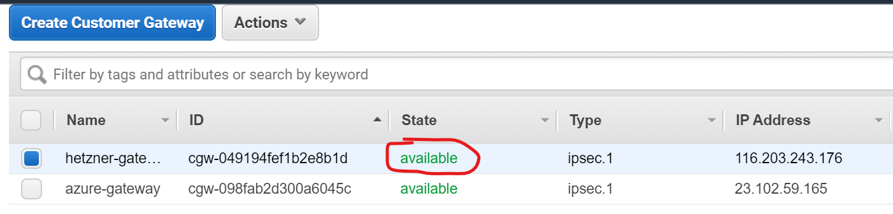

# Connecting VMs on Hetzner to those on AWS / Azure

This is part of the report on item [#146](https://app.clubhouse.io/thinkdeep/story/146/investigate-and-design-an-architecture-to-connect-the-vms-across-different-cloud-providers-revisited). There are two notable differences between Hetzner and the mainstream cloud providers:

- There is no concept of a VPC. Instead, separation can be achieved through separate projects or networks within a single project.
- There is no managed VPN service.

## Singletenancy

We are going for a setup similar to this, except that instead of a dedicated system, we have another cloud service, and instead of a VSwitch, we have a VPN server and a client on both sides.


OpenSWAN, LibreSWAN, and StrongSWAN are some of the FOSS IPSec implementations for Linux with IKEv2 support. The easiest way to get them running on HCloud is a pre-built docker image (e.g. for [LibreSWAN](https://github.com/hwdsl2/docker-ipsec-vpn-server), but what about performance?). AnySWAN provides an internal-facing and an internet-facing interface, as shown below:


The internet-facing interface will connect to AWS (Azure, Proxmox), the internal-facing interface to the tenant's network (or, hopefully, tenants' networks?).

AWS provides [example configurations](https://docs.aws.amazon.com/vpn/latest/s2svpn/cgw-static-routing-examples.html) for OpenSWAN and StrongSWAN, among others. These configs can be downloaded from the console and are pre-populated with the actual values. Unfortunately, following these instructions with StrongSWAN did not work. The VPN tunnel itself seems to be established:



Yet, from the HCloud side, no route to machines on AWS can be found. From the AWS side, we see IP packages never reach their desination:

```text
traceroute to 10.0.1.2 (10.0.1.2), 30 hops max, 60 byte packets
 1  ec2-52-66-0-36.ap-south-1.compute.amazonaws.com (52.66.0.36)  1.804 ms ec2-52-66-0-32.ap-south-1.compute.amazonaws.com (52.66.0.32)  81.177 ms ec2-52-66-0-38.ap-south-1.compute.amazonaws.com (52.66.0.38)  42.208 ms
 2  * * *
 3  * * *
 4  * * *
 5  * * *
 6  * * *
 7  * * *
 8  * * *
 9  * * *
10  * * *
11  * *^C
```

### Possible next steps

- Investigate what's wrong with the routing
- Try OpenSWAN

## Multitenancy

*tbd depending on outcome of singletenancy*, best case scenario: we can use only a single SWAN instance as a VPN gateway for all tenants on Hetzner / Proxmox and route packages so that tenant separation is maintaned.
