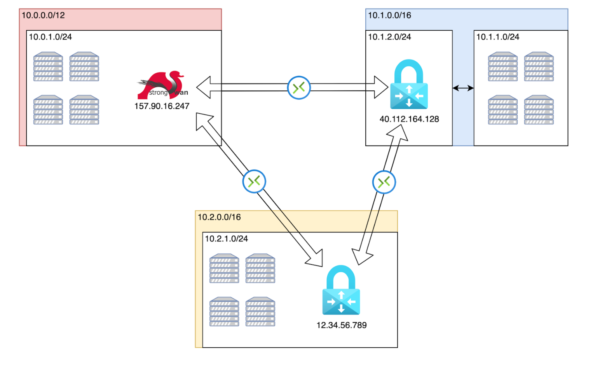

# Terraform modules
This is our root directory for [terraform modules](https://www.terraform.io/docs/modules/index.html).
We define one module per cloud provider, with each possibly having more submodules.  

## Usage
### TL;DR
Create and populate a ``terraform.tfvars`` file in this directory. Use 
[terraform.tfvars.example](terraform.tfvars.example) as a template. 

Set the ``git_checkout_branch`` variable in the `main.tf` to the branch you want to work with. 

To build the entire infrastructure:
```
terraform apply
```

After the process is finished you should be able to access the following dashboards:
* Grafana Dashboard: http://<hetzner.gateway_ipv4_address>:3000
* CockroachDB Dashboard: http://\<any public ip that is not a gateway\>:8080

A full build of the infrastructure takes over 30 minutes because the azure gateway is very slow. 
You can deploy only a part of the infrastructure by using the `-target` parameter. 
This infrastructure should take less then 30 minutes to complete:
```
terraform apply -target=module.hetzner -target=module.gcp -target=module.tooling 
```

### Terraform modules
To use a module, simply call it in your terraform script and provide respective variable names.
This will create all the resources listed in that module when executing ``terraform apply``.
```
module "gcp" {
  source                       = "modules/gcp"
  azure_gateway_ipv4_address   = module.azure.azure_gateway_ipv4_address
  azure_subnet_cidr            = local.azure_vm_subnet_cidr
  ...
  ...
```

The current state of the infrastructure is being deployed in the top-level ``main.tf``.

Before being able to apply that script, a ``terraform.tfvars`` file must be created based on 
[terraform.tfvars.example](terraform.tfvars.example). You need to supply all credentials in that file. If
you create the file in this directory, terraform will automatically pick it up.

After that, you can apply the script.
```
terraform apply
```

## Infrastructure
The current infrastructure consists of the following components:
- build on GCP, Azure, Hetzner and Proxmox:
    - internal networks
    - external network / resinfra net
    - worker vms and deployment of distributed service
- build on Hetzner and Proxmox:
    - gateway vm
    - monitoring
- build only on Hetzner:
  - builder vm that triggers provisioning

### Internal networks
On all providers, a new virtual private network is created including a subnet that holds the worker vms. Depending
on the implementation requirements of the specific cloud provider, an additional subnet is required for the gateways 
that will connect to other nodes in the resinfra net. All subnets are disjoint as they will be unified to one virtual
network for the resinfra net. The cidr distribution currently looks as follows.
```
  azure_cidr                = cidrsubnet(var.vpc_cidr, 8, 1)    # 10.1.0.0/16 (Azure does not allow to add overlapping subnets when creating vpn routes)
  azure_vm_subnet_cidr      = cidrsubnet(var.vpc_cidr, 16, 256) # 10.1.0.0/24
  azure_gateway_subnet_cidr = cidrsubnet(var.vpc_cidr, 16, 257) # 10.1.1.0/24

  gcp_cidr           = cidrsubnet(var.vpc_cidr, 8, 2)    # 10.2.0.0/16
  gcp_vm_subnet_cidr = cidrsubnet(var.vpc_cidr, 16, 512) # 10.2.0.0/24

  hetzner_cidr           = var.vpc_cidr                      # 10.0.0.0/8 (Hetzner needs to have all subnets included in the big VPN)
  hetzner_vm_subnet_cidr = cidrsubnet(var.vpc_cidr, 16, 768) # 10.3.0.0/24

  proxmox_cidr           = cidrsubnet(var.vpc_cidr, 8, 4)       # 10.4.0.0/16
  proxmox_vm_subnet_cidr = cidrsubnet(local.proxmox_cidr, 8, 0) # 10.4.0.0/24
```
These are defined in the top-level ``main.tf`` file.

### External network (resinfra net)
The network between the internal networks is created by creating site-to-site IPsec tunnels. These tunnels are created 
between gateways that then forward requests to the specific machine within their network. As a result, all machines can 
reach each other from the set of private subnet cidrs (`10.1.0.0/24, 10.2.0.0/24, 10.3.0.0/24, 10.4.0.0/24`). 

For Azure and GCP, managed gateway services are used while a gateway machine is manually created and set up for hetzner 
using [StrongSwan](https://wiki.strongswan.org/projects/strongswan) and for Proxmox using [Libreswan](https://libreswan.org/).

### Worker vms and deployment of cockroachdb
A fixed number of worker vms is created on each cloud provider that will be used to run the distributed service, namely 
cockroachdb. That number is set in the `instances` variable of the top-level ```variables.tf``` file. During 
`terraform apply` a list of all vm ips is dynamically created in order to install cockroachdb on all targets. A builder
vm is created on one of the providers (currently Hetzner) to trigger all necessary Ansible scripts on the worker vms.

### Monitoring
Monitoring is set up through the builder vm and ansible scripts. A docker container running the 
[node exporter](https://prometheus.io/docs/guides/node-exporter/) is installed on all worker vms. On the monitoring 
machine a prometheus instance is installed to collect metrics from respective targets. Metrics are then 
displayed in Grafana.


